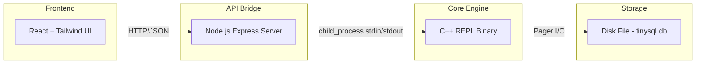

# TinySQL — Disk-Persistent Relational Database Engine

A simplified SQLite-like database engine with B+ Tree indexing, REST API, and a modern web frontend.

## Architecture Overview



> [!IMPORTANT]
> **API Bridge Strategy**: We'll use a Node.js Express server that spawns the C++ binary as a child process and communicates via stdin/stdout. This avoids the complexity of embedding an HTTP server in C++ while keeping the architecture clean and portable on Windows.

---

## Proposed Changes

### Component 1: C++ Core Engine

The heart of the system. All files live in `d:\ML\TinySQL\engine\`.

---

#### [NEW] [constants.hpp](file:///d:/ML/TinySQL/engine/constants.hpp)
- Page size: `4096` bytes
- Max username length: `32`
- Max email length: `255`
- Row size computed from struct layout
- B+ Tree order derived from page size / key+pointer size
- Node type enum: `INTERNAL`, `LEAF`

#### [NEW] [row.hpp](file:///d:/ML/TinySQL/engine/row.hpp)
- `Row` struct: `uint32_t id`, `char username[32]`, `char email[255]`
- `serialize_row(Row* src, void* dest)` — copies row fields to page memory
- `deserialize_row(void* src, Row* dest)` — reads row fields from page memory
- Fixed-size layout with `memcpy` for deterministic serialization

#### [NEW] [pager.hpp](file:///d:/ML/TinySQL/engine/pager.hpp) / [pager.cpp](file:///d:/ML/TinySQL/engine/pager.cpp)

**Pager Design:**
- Manages a file-backed array of 4KB pages
- Maintains a cache of up to `TABLE_MAX_PAGES` (100) pages in memory
- Tracks which pages are "dirty" (modified but not flushed)
- Uses `_lseeki64` / `_read` / `_write` on Windows (with `lseek`/`read`/`write` on POSIX)

```
┌──────────────────────────┐
│     Pager                │
│  ┌─────┐ ┌─────┐        │
│  │Pg 0 │ │Pg 1 │ ...    │  ← In-memory cache
│  └──┬──┘ └──┬──┘        │
│     │       │            │
│  ┌──▼───────▼──────────┐│
│  │  tinysql.db (disk)  ││  ← File storage
│  └─────────────────────┘│
└──────────────────────────┘
```

Key methods:
- `Pager(const char* filename)` — open/create file
- `void* get_page(uint32_t page_num)` — load from disk or return cached
- `void flush(uint32_t page_num)` — write dirty page to disk
- `void flush_all()` — flush all dirty pages
- `uint32_t num_pages()` — file size / page size

#### [NEW] [btree.hpp](file:///d:/ML/TinySQL/engine/btree.hpp) / [btree.cpp](file:///d:/ML/TinySQL/engine/btree.cpp)

**B+ Tree Structure:**

Each node occupies exactly one 4KB page. The layout:

**Leaf Node Layout:**
```
┌─────────────────────────────────────────┐
│ node_type (1B) │ is_root (1B) │ parent (4B)│
│ num_cells (4B) │ next_leaf (4B)         │
├─────────────────────────────────────────┤
│ Cell 0: [key (4B)] [Row value (291B)]   │
│ Cell 1: [key (4B)] [Row value (291B)]   │
│ ...                                     │
│ Cell N                                  │
└─────────────────────────────────────────┘
```

**Internal Node Layout:**
```
┌─────────────────────────────────────────┐
│ node_type (1B) │ is_root (1B) │ parent (4B)│
│ num_keys (4B) │ right_child (4B)          │
├─────────────────────────────────────────┤
│ Child 0 (4B) │ Key 0 (4B)               │
│ Child 1 (4B) │ Key 1 (4B)               │
│ ...                                     │
└─────────────────────────────────────────┘
```

**Node Splitting Algorithm (Leaf):**
1. Insert key into sorted position
2. If `num_cells > LEAF_MAX_CELLS`:
   - Create new leaf node (new page)
   - Split: left gets first half, right gets second half
   - Set `next_leaf` of left → new_leaf, `next_leaf` of new_leaf → old next
   - Push the smallest key of the right node up to the parent
3. If parent is full → split internal node recursively

**Node Splitting Algorithm (Internal):**
1. When a child splits, a key is pushed up
2. Insert key in sorted order among existing keys
3. If `num_keys > INTERNAL_MAX_KEYS`:
   - Split internal node
   - Push middle key up to parent
   - If node is root → create new root

Key functions:
- `Cursor btree_find(Pager&, uint32_t root, uint32_t key)` — O(log n) search
- `void btree_insert(Pager&, uint32_t root_page, Row& row)` — O(log n) insert
- `void leaf_node_split_and_insert(...)` — handles leaf overflow
- `void internal_node_insert(...)` — handles key promotion
- `void create_new_root(...)` — handles root splitting

#### [NEW] [main.cpp](file:///d:/ML/TinySQL/engine/main.cpp)
- REPL loop reading from stdin
- Parses meta-commands (`.exit`)
- Parses SQL-like commands: `insert`, `select`, `find`
- Outputs results to stdout in a parseable format
- JSON output mode for API consumption (triggered by `.mode json` or command-line flag)

#### [NEW] [Makefile](file:///d:/ML/TinySQL/engine/Makefile)
```makefile
CXX = g++
CXXFLAGS = -std=c++17 -Wall -Wextra -g
TARGET = tinysql

all: $(TARGET)

$(TARGET): main.cpp pager.cpp btree.cpp
	$(CXX) $(CXXFLAGS) -o $@ $^

clean:
	del /Q $(TARGET).exe 2>nul

run: all
	./$(TARGET) tinysql.db
```

---

### Component 2: Node.js API Bridge

Lives in `d:\ML\TinySQL\api\`.

---

#### [NEW] [server.js](file:///d:/ML/TinySQL/api/server.js)
- Express.js server on port `3001`
- Spawns the C++ `tinysql.exe` binary as a child process with `--json` flag
- Sends commands via stdin, reads JSON responses from stdout
- Implements a command queue for thread safety (serializes requests)

Endpoints:
| Method | Path | Description |
|--------|------|-------------|
| `POST` | `/api/insert` | Body: `{id, username, email}` → sends `insert ...` |
| `GET` | `/api/select` | Returns all rows via `select` |
| `GET` | `/api/find?id=N` | Returns single row via `find N` |
| `GET` | `/api/health` | Health check |

#### [NEW] [package.json](file:///d:/ML/TinySQL/api/package.json)
- Dependencies: `express`, `cors`, `body-parser`

---

### Component 3: React Frontend

Lives in `d:\ML\TinySQL\frontend\`. Created with Vite.

---

#### UI Design

Terminal-inspired dark theme with a hacker/developer aesthetic:
- Background: `#0a0a0f` (near-black)
- Primary accent: `#00ff88` (matrix green)
- Secondary accents: `#00d4ff` (cyan), `#ff6b6b` (red for errors)
- Font: `JetBrains Mono` (monospace)
- Glassmorphism panels with subtle borders
- Smooth micro-animations on interactions
- CRT scanline effect on the terminal area

#### Pages/Components:

| Component | Description |
|-----------|-------------|
| `App.jsx` | Layout shell with sidebar navigation |
| `QueryConsole.jsx` | Terminal-style command input + output display |
| `TableViewer.jsx` | Paginated data table for `select` results |
| `SearchPanel.jsx` | ID lookup → single row display |
| `InsertForm.jsx` | Form with id, username, email fields |
| `StatusBar.jsx` | Connection status, row count, DB file size |

> [!NOTE]
> Per the user's request, we'll use **Tailwind CSS** for styling. We'll use **Tailwind v3** with the Vite plugin.

---

## Folder Structure

```
d:\ML\TinySQL\
├── engine/                  # C++ core
│   ├── constants.hpp
│   ├── row.hpp
│   ├── pager.hpp
│   ├── pager.cpp
│   ├── btree.hpp
│   ├── btree.cpp
│   ├── main.cpp
│   └── Makefile
├── api/                     # Node.js bridge
│   ├── server.js
│   └── package.json
├── frontend/                # React + Vite + Tailwind
│   ├── src/
│   │   ├── App.jsx
│   │   ├── main.jsx
│   │   ├── index.css
│   │   ├── components/
│   │   │   ├── QueryConsole.jsx
│   │   │   ├── TableViewer.jsx
│   │   │   ├── SearchPanel.jsx
│   │   │   ├── InsertForm.jsx
│   │   │   └── StatusBar.jsx
│   │   └── api.js           # Fetch wrapper
│   ├── index.html
│   ├── tailwind.config.js
│   ├── vite.config.js
│   └── package.json
└── README.md
```

---

## Build & Run Instructions

```bash
# 1. Build C++ engine
cd engine
make            # produces tinysql.exe

# 2. Start API server
cd ../api
npm install
node server.js  # starts on :3001, spawns tinysql.exe

# 3. Start frontend
cd ../frontend
npm install
npm run dev     # starts Vite dev server on :5173
```

---

## Example Workflow

```
1. User opens UI at localhost:5173
2. Types in Query Console: insert 1 alice alice@example.com
   → Frontend POSTs to /api/insert with {id:1, username:"alice", email:"alice@example.com"}
   → API sends "insert 1 alice alice@example.com\n" to C++ stdin
   → C++ responds with JSON: {"status":"success","message":"Row inserted"}
   → UI shows success in terminal output

3. Clicks "View All" in Table Viewer
   → Frontend GETs /api/select
   → API sends "select\n" to C++ stdin
   → C++ traverses leaf nodes, outputs JSON array of rows
   → UI renders paginated table

4. Types ID=1 in Search Panel
   → Frontend GETs /api/find?id=1
   → API sends "find 1\n" to C++ stdin
   → C++ does B+ Tree lookup, returns JSON row
   → UI shows result card
```

---

## Open Questions

> [!IMPORTANT]
> **Compiler availability**: Do you have `g++` installed on your Windows system (e.g., via MinGW or MSYS2)? If not, I can provide a solution using MSVC (`cl.exe`) or help you install MinGW. This is critical for building the C++ engine.

> [!NOTE]
> **Node.js**: The API bridge requires Node.js. I'll assume it's available since you've used npm in prior projects. Please confirm if this is not the case.

---

## Verification Plan

### Automated Tests
1. **C++ Engine**: Build and run the binary, execute a sequence of insert/find/select commands via stdin, verify correct output
2. **API Layer**: Start the server, use `curl` or the browser to hit all endpoints, verify JSON responses
3. **Frontend**: Launch Vite dev server, use the browser subagent to:
   - Insert sample rows via the Insert Form
   - Verify they appear in the Table Viewer
   - Search by ID and verify results
   - Run commands in the Query Console

### Manual Verification
- Restart the C++ engine and verify data persists from disk
- Insert enough rows to trigger B+ Tree node splits and verify correctness
